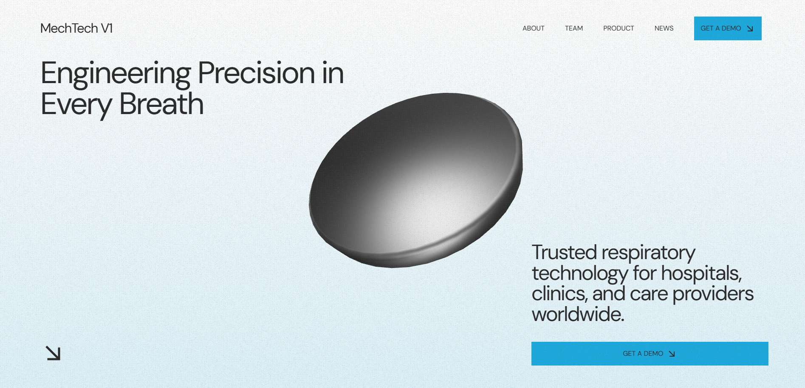
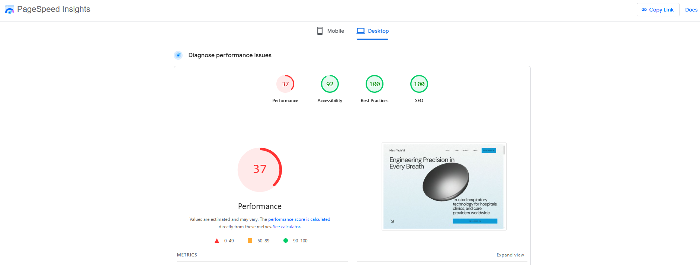
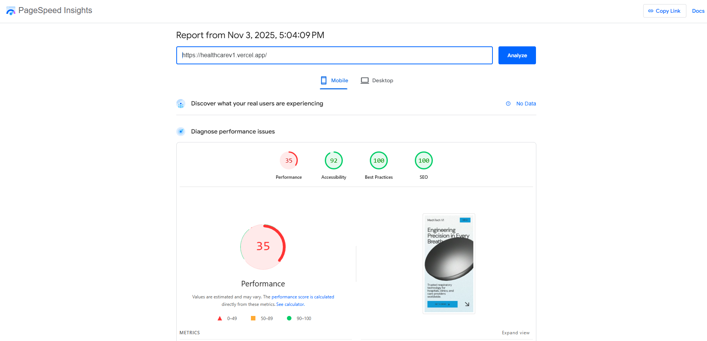

# Mech Tech V1 - For Front End Development
Mech Tech V1 is created with Next.js with Typescript including the some other helpers that i will list down in the tech-stack below.
It's mainly build to actually to increase the SEO for easier appearance in the search engine and having a story-flow while user scroll through the page.
It's a Single Landing Page Application with different section bundled in one 

[Live-Demo](https://healthcarev1.vercel.app/)


# Main Goals:
- Next.js - Understanding App Router, Server Components, and all the new features
- TypeScript - Getting comfortable with types and interfaces
- Tailwind CSS - Mastering utility-first CSS
- SEO Basics - Learning how to make websites search-engine friendly
- Blender Basic - Creating simple geometry cubes
- Framer Motion - Animation
- Three.js - For customization of GLTF("Imported file from Blender") to showcase 3d effects.


- Side Quests:
- Lenis Basic - to achieve those awwwards winning scroll.
- Responsive design that works everywhere

# Tech Stack:
- Next.js 14      
- TypeScript      
- Tailwind CSS    
- Framer Motion 
- Three.js 
- Lenis 

# Getting Started
```js
1. Clone Repo
- git clone https://github.com/xinhanlim/healthcarev1
cd healthcarev1

# 2. Install dependencies
npm install

# 3. Running 
npm run dev
```
- Then open http://localhost:3000 and watch my progress!

# Resources Helping Me Learn
- 3D Animations => [Youtube- @olivierlarose1](https://www.youtube.com/@olivierlarose1) 
- Blender => [Youtube-Blender Basic Tutorial](https://www.youtube.com/watch?v=4haAdmHqGOw&t=2190s)
- Next.js + Typescript => [Udemy](https://www.udemy.com/share/101uUA3@HiaGsJ6bM8Qr6cOKksgfJxSS4bcNjuY4Fo_UjGHM7UnY7QGc1T-0-dCnLWKLxxeBTg==/)
- Framer-Motion Docs => [Framer-Motion](https://motion.dev/docs/framer)


# ScreenShot 





# Question that i asked myself
- What can i do to increase the performance rating and will it affect the aesthetic of it?
- what are the factors that affecting the performance?

# Done-by
**Lim Xin Han** – [Portfolio](https://xinhanlim.vercel.app)


